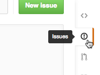

# planning

Planning and discussion for NUSH Infocomm

## How to use GitHub

First, [create](https://github.com/join) an account. 

Then, on this repository, add an [issue](https://github.com/nushinfocomm/planning/issues/new) and put anything the title and I'll add you into the organisation. 

### How to modify a file (for beginners)

Just open up the [code](https://github.com/nushinfocomm/planning) and select a file and press the edit button. 

And then edit your file (it's [markdown](#markdown))

When done, scroll down, give your change a title and press "Commit changes". 

Don't worry, you should **make as many commits as you can** to describe the changes. 

## Markdown

Markdown is a syntax to write formatted plaintext documents. 

This [guide](https://guides.github.com/features/mastering-markdown/) will get you very quickly into markdown. Don't worry, it's easy. 

## Viewing past changes

Click on [commits](https://github.com/nushinfocomm/planning/commits)

## Submitting issues

Can be regards to anything: feedback, problems, help.  

Click on [issues](https://github.com/nushinfocomm/planning/issues) and create a new issue

It's rather self-explanatory. 